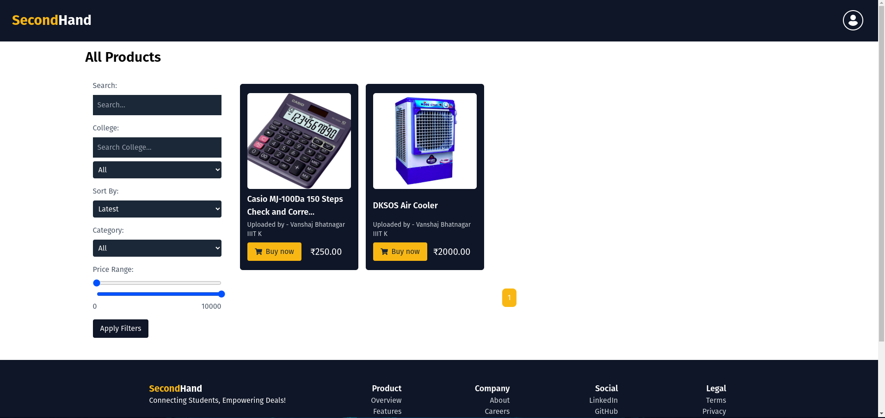
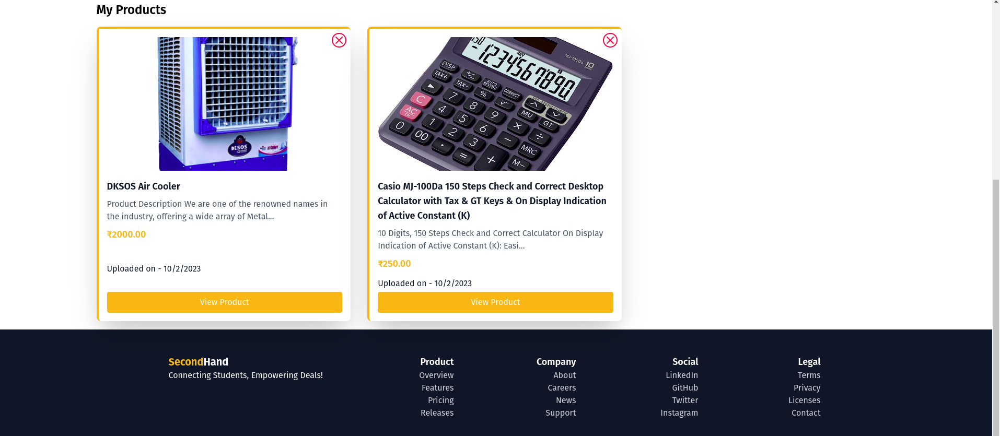
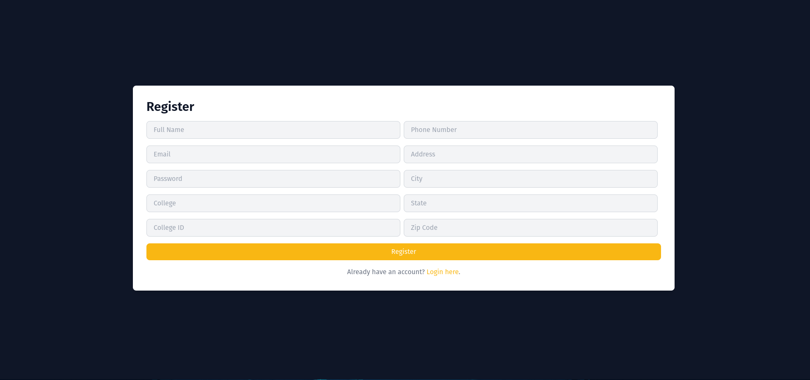
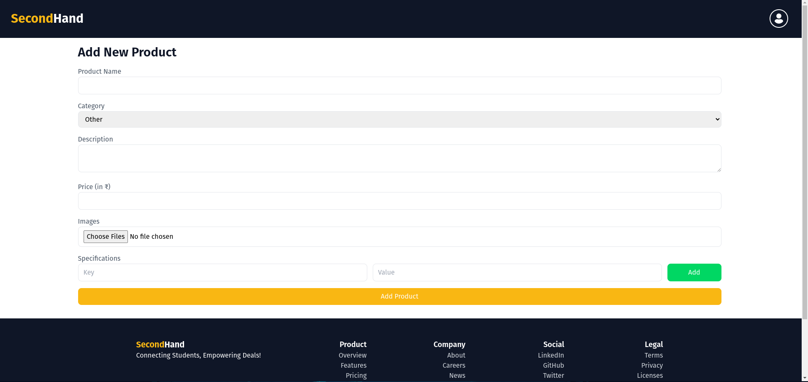

# SecondHand E-commerce Platform

Welcome to **SecondHand**, a unique e-commerce platform crafted specifically for college students! Here, students can effortlessly trade pre-owned items with their peers, building a sustainable and convenient marketplace right on campus. This initiative not only supports the reuse of resources but also cuts down on transportation expenses by keeping exchanges local.

## Website Url

https://second-hand-client.onrender.com/

## Project Overview

**SecondHand** is an online marketplace tailored for college students, enabling them to sell items like cycles, mattresses, coolers, and more to incoming freshers. By facilitating the reuse of products.

## Getting Started

1. **Clone the Repository:**

```
git clone "https://github.com/AnshSomani/SecondHand"
cd SecondHand
```

2. **Install Dependencies:**

- Navigate to the `Client` folder and run `npm install`.
- Navigate to the `Server` folder and run `npm install`.

3. **Setup MongoDB:**

- Create a `.env` file in the `Server` folder.
- Add your MongoDB URI and Database name to the `.env` file.
  ```
  MONGODB_URI=<your-mongodb-uri>/database-name
  ```

4. **Start the Application:**

- To start the frontend, run `npm start` in the `Client` folder.
- To start the backend, run `nodemon server` in the `Server` folder.

## Screenshots






